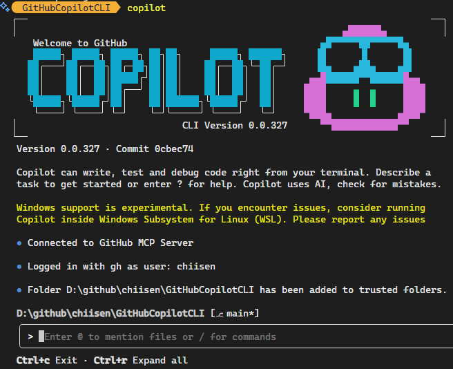
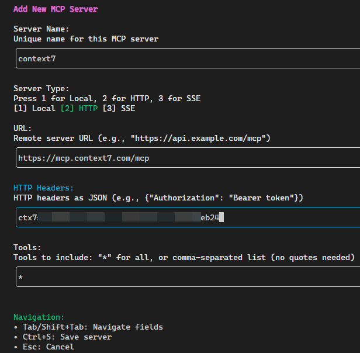

# GitHubCopilotCLI



## 介紹
GitHub Copilot CLI 現已公開預覽，讓開發者可直接在終端機中使用 GitHub Copilot 智能編程助手，無需切換上下文。它具備以下特色：

- 原生終端機開發體驗，能在命令行內同步與 AI 代理互動。
- 預設整合 GitHub 賬戶，能以自然語言存取倉庫、議題和合併請求。
- 具備強大的計劃與執行複雜任務能力，可協助建構、編輯、除錯和重構代碼。
- 支援 MCP 伺服器擴展，既包含 GitHub MCP 伺服器也支援自訂伺服器。
- 用戶可以預覽和審核每個動作，所有操作均需明確授權。

安裝方式簡單，透過 npm 安裝後，使用 GitHub 賬戶認證即可開始體驗，適用於 Copilot Pro、Pro+、Business 和 Enterprise 用戶。這工具適合探索新代碼庫、實作議題功能及本地除錯使用。

## 安裝
- Node.js v22 或更高版本
```bash
npm install -g @github/copilot
```

## 啟動 CLI
```bash
copilot
```

## 新增 MCP - context7
參考: https://github.com/upstash/context7

### Using Context7 with Copilot Coding Agent
Add the following configuration to the mcp section of your Copilot Coding Agent configuration file Repository->Settings->Copilot->Coding agent->MCP configuration:
```json
{
  "mcpServers": {
    "context7": {
      "type": "http",
      "url": "https://mcp.context7.com/mcp",
      "headers": {
        "CONTEXT7_API_KEY": "YOUR_API_KEY"
      },
      "tools": ["get-library-docs", "resolve-library-id"]
    }
  }
}
```

### API Key
https://context7.com/dashboard




