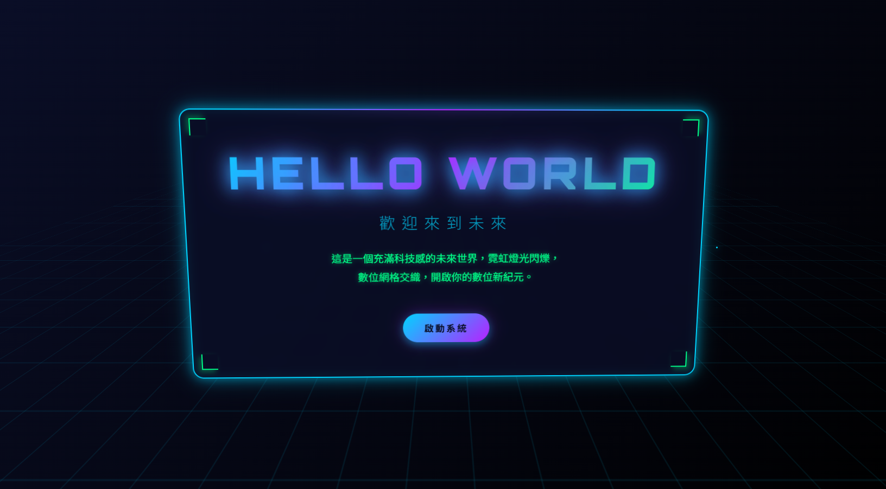

# GitHubCopilotCLI


## 介紹
GitHub Copilot CLI 現已公開預覽，讓開發者可直接在終端機中使用 GitHub Copilot 智能編程助手，無需切換上下文。它具備以下特色：

- 原生終端機開發體驗，能在命令行內同步與 AI 代理互動。
- 預設整合 GitHub 賬戶，能以自然語言存取倉庫、議題和合併請求。
- 具備強大的計劃與執行複雜任務能力，可協助建構、編輯、除錯和重構代碼。
- 支援 MCP 伺服器擴展，既包含 GitHub MCP 伺服器也支援自訂伺服器。
- 用戶可以預覽和審核每個動作，所有操作均需明確授權。

安裝方式簡單，透過 npm 安裝後，使用 GitHub 賬戶認證即可開始體驗，適用於 Copilot Pro、Pro+、Business 和 Enterprise 用戶。這工具適合探索新代碼庫、實作議題功能及本地除錯使用。

## 安裝
- Node.js v22 或更高版本
目前 Windows 只能跑 WSL
```bash
npm install -g @github/copilot
```

## 啟動 CLI
```bash
copilot
```

## 新增 MCP - context7
參考: https://github.com/upstash/context7

### Using Context7 with Copilot Coding Agent
Add the following configuration to the mcp section of your Copilot Coding Agent configuration file Repository->Settings->Copilot->Coding agent->MCP configuration:
```json
{
  "mcpServers": {
    "context7": {
      "type": "http",
      "url": "https://mcp.context7.com/mcp",
      "headers": {
        "CONTEXT7_API_KEY": "YOUR_API_KEY"
      },
      "tools": ["get-library-docs", "resolve-library-id"]
    }
  }
}
```

### API Key
https://context7.com/dashboard


## DEMO


 ● ✨ 已為您生成「未來科技風」Hello World 網頁！

   📋 設計方案詳細說明：

   🎨 配色方案

     * 主色調：深太空藍 (#0a0e27) - 營造深邃的科技空間感
     * 次要色：電子藍 (#00d4ff) - 代表數位科技的冷光
     * 強調色：霓虹紫 (#b721ff) - 未來感的霓虹效果
     * 輔助色：青綠光 (#00ff88) - 科技介面的提示色
     * 背景漸層：深藍到黑色的漸層，模擬太空深度

   🔤 字體使用

     * 主標題：Orbitron (幾何感強烈的未來字體，字重 900)
     * 副標題與按鈕：Orbitron (保持一致性)
     * 內文描述：Rajdhani (現代科技感的輕量字體)
     * 字母間距：加大間距營造科技感 (8-12px)

   📐 版面結構

     1. 全螢幕居中佈局：視覺焦點集中
     2. 半透明容器：背景模糊效果 (backdrop-filter)
     3. 發光邊框：雙層霓虹光暈效果
     4. 動態背景網格：3D 透視網格動畫
     5. 四角裝飾框：科技介面的視覺元素

   ✨ 特殊效果

     * 文字漸層發光：多色漸層 + 陰影脈衝動畫
     * 容器脈衝：光暈強度循環變化
     * 粒子漂浮：9 個動態粒子從下往上飄移
     * 3D 滑鼠追蹤：容器隨滑鼠移動產生 3D 傾斜效果
     * 按鈕波紋互動：點擊產生漸層擴散波紋
     * 響應式設計：適配手機、平板、桌面各種螢幕

   🚀 使用方式：

     # 在瀏覽器中打開
     open hello-world-futuristic.html
     # 或
     xdg-open hello-world-futuristic.html

   文件位置：/mnt/d/github/chiisen/GitHubCopilotCLI/hello-world-futuristic.html

   這個網頁包含了完整的未來科技風格設計，具有動態效果、互動功能和響應式佈局。您可以直接在瀏覽器中打開查看效果！🎉

### PROMPT
```bash
請你為我生成一個 hello world 的 html 網頁主題風格。                                                                    │ 
請從以下風格中隨機選擇一種：                                                                    │ 
極簡風、復古風、未來科技風、自然風、藝術風。                                                                    │ 
每種風格包含特定的顏色方案、字體、版面佈局。                                                                    │ 
請根據所選風格詳細描述配色方案、字體使用及版面結構，產生完整的設計方案。
```